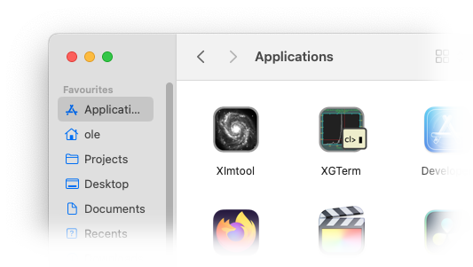

# Binary packages

## Linux

### Debian and derivatives (Ubuntu, Mint, Raspbian, …)

On Debian like systems, IRAF and xgterm can be installed directly from
the standard package repositories and can be installed with the
command

    $ sudo apt install iraf xgterm

This also installs the NOAO package. Development tools (**xc**,
**mkpkg** and development libraries) can be installed separately if
needed with the package **iraf-dev**. PyRAF is available as
**python3-pyraf** package.

Depending on the distribution, there are also some external packages
available as **iraf-fitsutil**, **iraf-mscred**, **iraf-rvsao**,
**iraf-sptable**, **iraf-st4gem**, **iraf-wcstools** and
**iraf-xdimsum**.

### Other distributions

On Mageia Linux, IRAF can also be directly installed from the package
repositories. Packages for Fedora Linux are available from the RPM
Sphere third-party repository.

Please contact us if you want to help packaging for macOS or other
Linux versions.

## macOS

For macOS, a beta release of the installer is available. Please
download the installer (~100 MB) for your system:

 * [Apple Silicon (macOS 11 or newer)](https://github.com/iraf-community/iraf-mac-build/releases/download/v2.17.1-beta2/iraf-2.17.1-beta2-arm64.pkg)

 * [Intel 64 bit (OS X 10.10 or newer)](https://github.com/iraf-community/iraf-mac-build/releases/download/v2.17.1-beta2/iraf-2.17.1-beta2-x86_64.pkg)

 * [Intel 32 bit (Mac OS X 10.6 – 10.14)](https://github.com/iraf-community/iraf-mac-build/releases/download/v2.17.1-beta2/iraf-2.17.1-beta2-i386.pkg)

Keep in mind that the installer is a ***beta*** version and contact us
in case of installation problems.

After downloading, open the installer package by right-clicking on the
icon and selecting **Open**. As the software is not signed with an
Apple certificate, a window will show with a warning that the package
comes from an unidentified packager. Click on **Open** to continue.

{: width="70%"}

Follow now the installer instructions by clicking on **Continue**. In
the **Installation Type** screen, adjust the list of packages for your
needs. Aside from the main IRAF package and X11IRAF, a selection of
[external packages](external.html) is offered. The [**st4gem**
package](https://iraf.readthedocs.io/en/latest/tasks/st4gem/index.html)
offers a number of tasks from the discontinued STSDAS package and can
be used as an alternative.

{: width="70%"}

IRAF will be installed under `/usr/local/lib/iraf/` and the installer
will ask you for the root password of the machine. At the end you will
see a screen like this:

{: width="70%"}

If **X11IRAF** was selected, two new applications, **xgterm** and
**ximtool** are installed:

{: width="50%"}

For these applications, you will need an X server
([XQuartz](https://www.xquartz.org/)). As an alternative image
display, most people install [SAOImageDS9](https://ds9.si.edu/). For
development, the XCode command line tools are needed.

# Installation from source

## System Requirements and Dependencies

The distributed binaries require the readline or libedit, curl, expat,
and zlib libraries to be installed.

On Debian and its derivatives (Ubuntu, Mint, Devuan, Raspbian etc.):

	$ sudo apt install gcc make flex bison zlib1g-dev
	$ sudo apt install libcurl4-openssl-dev libexpat-dev libreadline-dev

On Fedora and its derivatives (Redhat, Scientific Linux etc.)

	$ sudo dnf install gcc make perl flex bison zlib-devel
	$ sudo dnf install libcurl-devel expat-devel readline-devel

On MacOS X, you need to have the XCode tools installed. If you
haven't, you can install them with:

	$ xcode-select --install

Click "Install" to download and install Xcode Command Line Tools.

## Download and unpack the IRAF Distribution

IRAF v2.17.1 source code is available from Github at

[https://github.com/iraf-community/iraf/archive/refs/tags/v2.17.1.tar.gz](https://github.com/iraf-community/iraf/archive/refs/tags/v2.17.1.tar.gz)

The source distribution file is built as a tarball with the package
name and version as base directory. Thus, distribution files can be
unpacked with the command

	$ tar zxf /<path>/v2.17.1.tar.gz
	$ cd iraf-2.17.1/

## Build from Sources

Now you can compile IRAF on your system with the command

	$ make 2>&1 | tee build.log

The following IRAF architectures are supported:

Architecture | Operating system | Supported CPU types
-------------|------------------|---------------------------------------------
`linux64`    | Linux 64 bit     | x86\_64, arm64, mips64, ppc64, riscv64, alpha
`linux`      | Linux 32 bit     | i386, x32, arm, mips
`macos64`    | macOS 64 bit     | arm64
`macintel`   | macOS 64 bit     | x86\_64
`macosx`     | macOS 32 bit     | i386
`freebsd64`  | FreeBSD 64 bit   | x86\_64
`freebsd`    | FreeBSD 32 bit   | i386, arm
`hurd`       | GNU HURD 32 bit  | i386

Note that Cygwin and big endian architectures like macosx/ppc are not
supported anymore.

## Test the Build

IRAF comes with a small set of basic tests to ensure that the build
works fine. To execute the tests, run:

	$ make test

The output should look like

	ecl.e: README.md
	ecl.e: files.md ......
	ecl.e: images.imcoords.md ...........
	ecl.e: images.imfilter.md .x............
	ecl.e: images.imfit.md ...
	ecl.e: images.imgeom.md ........
	ecl.e: images.immatch.md ..
	ecl.e: lists.md .......
	ecl.e: noao.astutil.md ........
	ecl.e: noao.digiphot.photcal.md .
	ecl.e: numerical-recipes.md ..........
	ecl.e: os.md ..
	ecl.e: programming.md ............
	ecl.e: sys.vops.md .
	ecl.e: test-syntax.md ...xs.
	ecl.e: testproc.md ..........................
	ecl.e: utilities.nttools.md ..............
	Test summary:  128 passed
	   1 skipped
	   2 xfailed

Note that `xfailed` (`x`) are e**x**pected **fail**ures, which one
does not need to worry about.

For details of the tests, see the file [`test/README.md`](test/README.md).

## Install the software at its final place

There are two options to install the build: system wide (by default
under `/usr/local/lib/iraf`), or in-place for the current user
only. If you have root (sudo, admin) access, the system wide
installation is the preferred option.

### System wide installation

The system wide installation copies everything that is needed to
`/usr/local/lib/iraf`, making it available for all users of the
computer. For this, do the following command:

	$ sudo make install

This also installs the links required to run iraf or its commands to
`/usr/local/bin`. After the installation finishes, one can directly
start using

	$ mkiraf
	$ ecl

Note that the `mkiraf` command is now optional if a local parameter
storage is not needed. Setting the `iraf` environment variable is not
needed to run the system.

### In-place installation

The in-place installation just configures the built system in its
current location.

	$ make inplace

This also installs the links required to run iraf or its commands to
`~/.iraf/bin`. This directory should be added to your `PATH` variable
so that the IRAF commands can be found by their name. Different to
previous versions, the installation does not touch your login files;
you should edit these files manually to add the path if
needed. Setting the `iraf` environment variable is not needed to run
the system.

## Customization variables

### Build customization

The build using **make** can be customized by a number of environment
variables:

 * **CC** - the C compiler to use (default: **cc**, which is the
   standard C compiler of the system). gcc and clang are both known to
   work.

 * **CFLAGS** - C compiler flags (default `-g -O2`). To
   build a 32-bit IRAF on a 64-bit system, add `-m32`.

 * **CPPFLAGS** - C preprocessor flags (default: empty).

 * **LDFLAGS** - Linker flags (default: empty). To
   build a 32-bit IRAF on a 64-bit system, add `-m32`.

 * **IRAFARCH** - IRAF architecture string. This is used as suffix for
   the binary directory names (i.e. `bin.linux64`, `unix/bin.linux64`,
   `noao/bin.linux64`) If not set, the IRAF architecture is determined
   automatically from the system. If set to an empty string `''`, the
   binary directories are just named `bin`, `unix/bin` and
   `noao/bin`. Note that external packages need to be adjusted to also
   allow suffix-less bin directory names when build in this case.

### Installation customization

The installation using **make install** recognizes the following
environment variables:

 * **prefix** - Common installation prefix (default: `/usr/local`). The
   installation goes to `${prefix}/lib/iraf`, with symlinks for the
   user-callable executables in `${prefix}/bin`, and the manpages
   installed in `${prefix}/share/man`. The `iraf` variable is set to
   `${prefix}/lib/iraf/`.

 * **DESTDIR** - directory name prepended to each installed target
   file. This is useful for package creators, where the files are not
   installed by **make** in their finaly installation.
